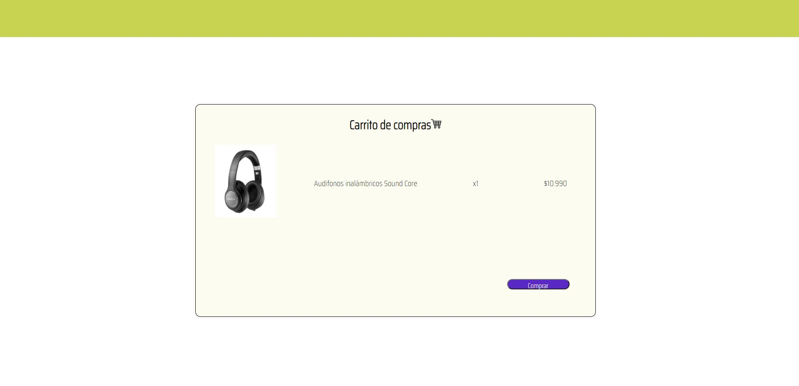

# Validación de Compra Segura

## Índice

* [1. Algorítmo de Luhn](#1-algorítmo-de-luhn)
* [2. Descripción del Producto](#2-descripción-del-proyecto)
* [3. Proceso de Creación](#3-proceso-de-creación)
* [4. Principales Usuarios y Objetivo](#4-principales-usuarios-y-objetivos)
* [5. ¿Qué esperamos resolver?](#5-qué-esperamos-resolver)
* [6. Prototipos](#6-prototipos)
* [7. Interfaz Final](#7-interfaz-final)
* [8. Enlace a Validación de compra segura](#8-enlace-a-validación-de-compra-segura)
* [9. Recursos](#9-recursos)

***

## 1. Algoritmo de Luhn
El Algoritmo de Luhn o también conocido por "algorítmo de módulo 10", es un método creado para la verificación de números de identificación, como los números de las tarjetas de crédito (Visa, MasterCard) o el IMEI de los teléfonos móviles.

Su creador fue Hans Peter Luhn, un científico de IBM y su uso ha sido tan extendido que desde que fue creado sigue controlando la creación y validación de todas las tajetas del mundo.

Este algoritmo nos dice que dada un número que contenga solamente dígitos [0-9], una tarjeta de crédito es válida si y solo si, obteniendo la reversa de este número, y la suma sus dígitos debe ser un múltiplo de 10, es decir que la suma módulo 10 debe ser igual a cero.

## 2. Descripción del Producto
Nuestro producto fue desarrollado para otorgar una experiencia de mayor seguridad dentro del contexto de E-commerce. Al momento de realizar una compra asegura que el comprador posee una tarjeta de crédito o débito válida para realizar la compra, lo que ofrece a los dueños de tiendas Online en plataformas web un entorno que asegura la reducción de fraudes.

## 3. Proceso de Creación
Nuestro producto fue desarrollado primeramente desde la mirada UX, pensamos en los posibles usuarios que podrían beneficiarse de nuestro producto. Posterior a eso desarrollamos en conjunto los prototipos de la interfaz en baja fidelidad y buscamos feedback de nuestras compañeras. Por último, iteramos la propuesta de interfaz en base a sus comentarios y sugerencias. Con ello, realizamos el prototipo en la plataforma Figma para finalmente desarollar en VSCode nuestro producto.

## 4. Principales Usuarios y Objetivo
Nuestros principales usuarios son dueños o usuarios de tiendas e- commerce para comprar online. El objetivo que tenemos con nuestro producto es que sea una herramienta que les otorgue seguridad al momento de realizar sus ventas online. 

## 5. ¿Qué esperamos resolver?
Esperamos resolver el problema de seguridad en las compras, ya que por medio de este producto, podrán saber que sus compradores poseen tarjetas válidas y reales. De modo que disminuya la posibilidad de estafa o compras ilícitas. 

## 6. Prototipos 
A continuación se muestran los diversos prototipos iterados

## 7. Interfaz Final

## 8. Enlace a "Validación de compra segura"
https://nicolepozo.github.io/SCL017-card-validation/

## 9. Recursos
* Stackoverflow : 
     * https://stackoverflow.com/questions/19249554/advice-on-how-to-code-luhn-credit-card-validation-with-javascript
* Github
* Git
* Youtube 
* Developers Mozilla : 
   * https://developer.mozilla.org/es/docs/Web/JavaScript/Reference/Global_Objects/Math/floor 
